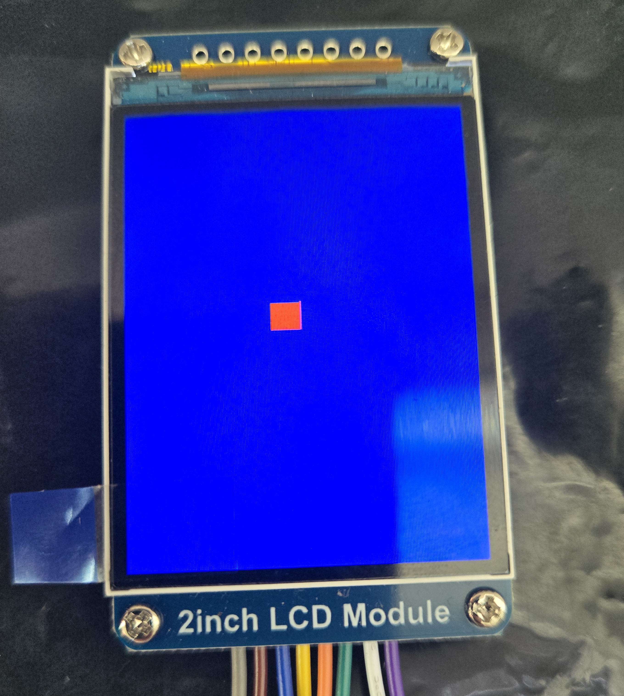

# DRAY

**DRAY** (Display Rendering librarY) is a C++ library for driving ST7789 display modules. It provides a C++ interface for STM32 devices to render basic graphics to the module, using libopencm3 as its backend. It has been tested on the STM32F446RE.

---

## Getting Started

1. Clone the repository:

   ```bash
   git clone https://github.com/yourusername/dray.git
   ```

2. Include the library in your project.

---

## Interface

### Constructor

```cpp id="n1z8qp"
lcd(uint16_t RESX, uint16_t CSX, uint16_t DCX, uint16_t SDA, uint16_t SCL, uint16_t BL);
```

Initializes the display object with the required GPIO pins:

* `RESX` – Reset pin
* `CSX`  – Chip Select pin
* `DCX`  – Data/Command pin
* `SDA`  – SPI MOSI pin
* `SCL`  – SPI Clock pin
* `BL`   – Backlight control pin

---

### Methods

#### `void start();`

Initializes the ST7789 display and prepares it for rendering. Must be called before any drawing operations.

---

#### `void set_color(COLOR col);`

Sets the current drawing color. All subsequent draw operations will use this color.

---

#### `void fill_screen();`

Fills the entire display with the currently selected color.

---

#### `void draw_rect(uint16_t ys, uint16_t ye, uint16_t xs, uint16_t xe);`

Draws a filled rectangle using the current color.

* `ys` – Start Y coordinate
* `ye` – End Y coordinate
* `xs` – Start X coordinate
* `xe` – End X coordinate


## Compile Examples

1. Navigate to project root and setup build directory
   ```bash
   meson setup build --cross_file cross_file.txt
   ```

2. Compile the example
   
   For Rectangle:
   ```bash
   meson compile -C build Rectangle
   ```
   
   For ConwaysGameOfLife:
   ```bash
   meson compile -C build Conway

3. Flash the binary

   For Rectangle:
   ```bash
   meson compile -C build flash_R
   ```
   
   For ConwaysGameOfLife:
   ```bash
   meson compile -C build flash_C

---
## Demonstration

Demonstration using **STM32F446RE** with Waveshare 2inch display with the following connections:

* **PA10** → Backlight
* **PB5** → DCX
* **PA9** → Reset
**SPI:**
* **PA4** → NSS
* **PA5** → SCK
* **PA7** → MOSI

## Basic Example:


## Conway Example:
<video src="assets/Conway.mp4" width="320" height="240" controls></video>


